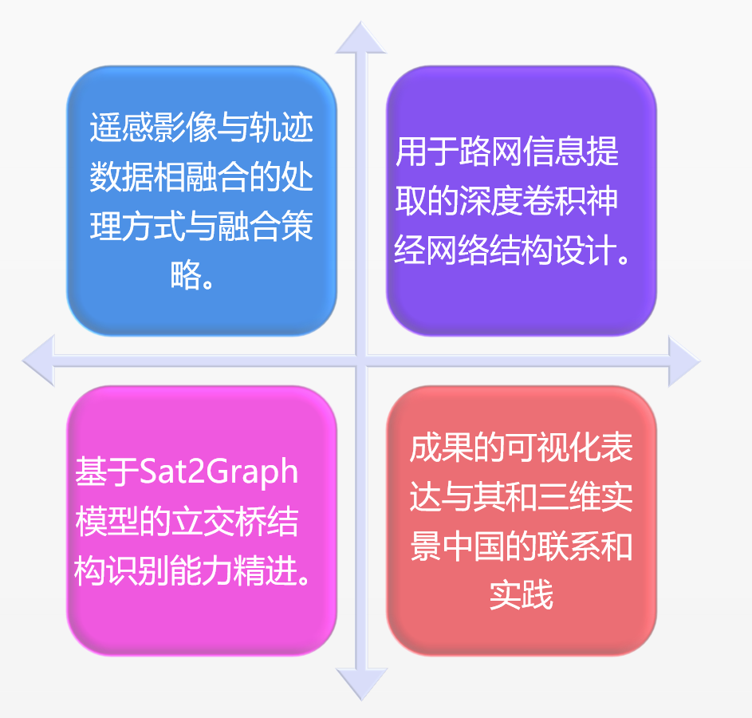
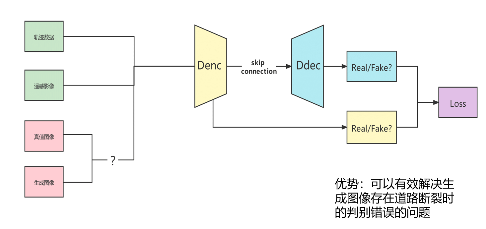
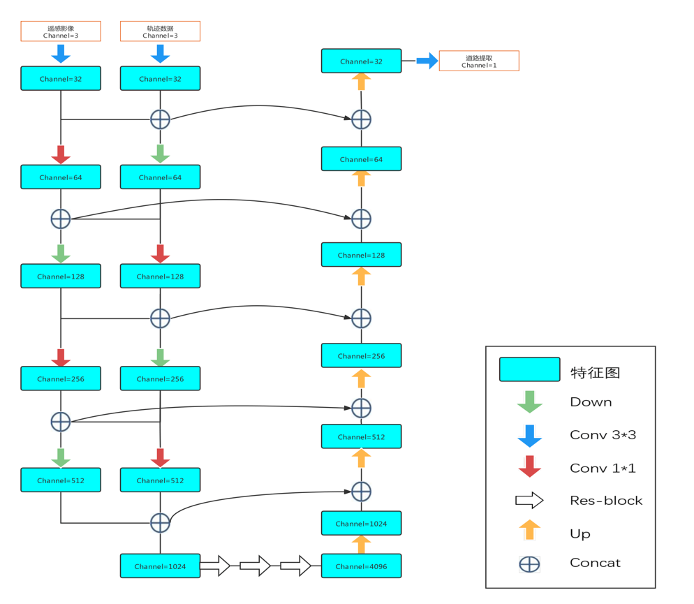
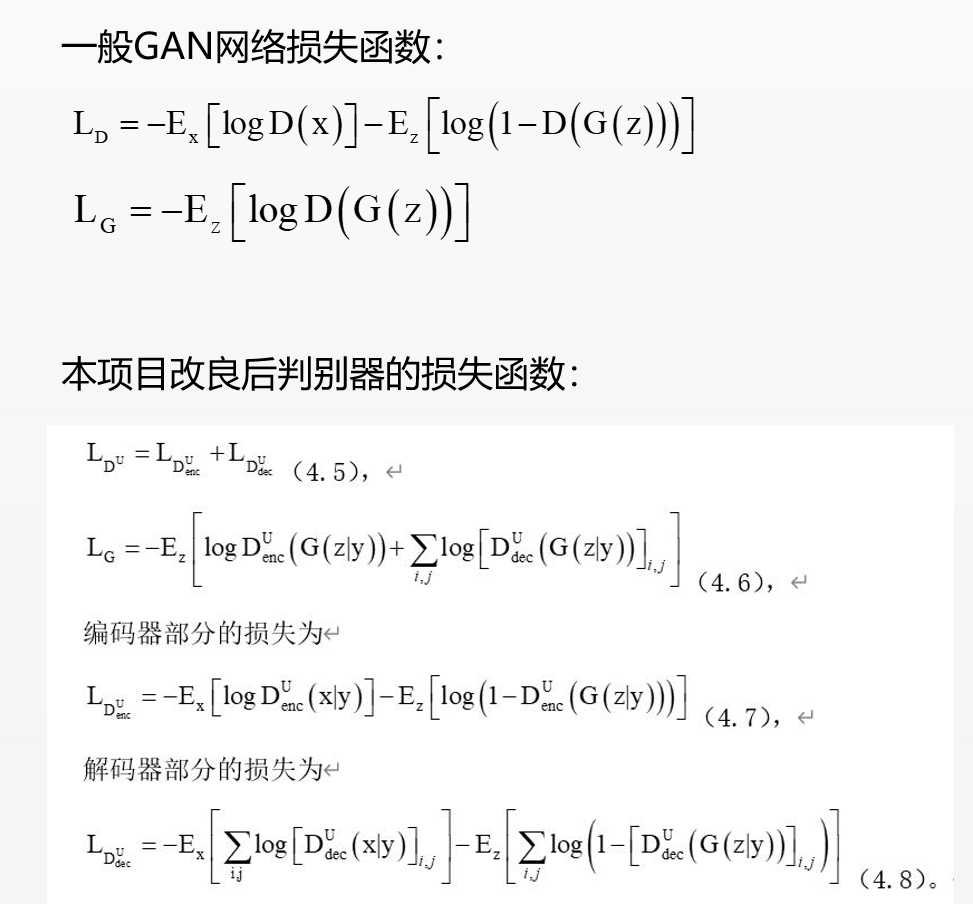

### Fusing Trajectories and RS Images to Recognize the Fine Structure of Overpass

本页面为`融合遥感影像与车辆轨迹数据的立交桥精细结构识别`项目主页。

项目可见[Github仓库-TZHSW](https://github.com/TZHSW/roadtest)或[Github仓库-Andytonglove](https://github.com/Andytonglove/roadtest)，感谢支持。😃

### 简介与计划

>近年来，随着智慧城市、三维实景中国建设的逐步推进，城市路网交通信息的精确获取与更新也变得愈发重要。然而，过去传统的道路信息提取研究往往局限于单一类型的数据源，对于道路结构的推断方法也存在着一定的局限性，在处理以立交桥为代表的这类具有复杂拓扑结构的立体交叉道口区域时效果欠佳。

本研究项目即是希望旨在创新性地采用多源融合的方式，同时使用遥感影像与轨迹数据，通过构建深度学习网络来识别立交桥这类复杂的交通区域。我们希望能通过研究基于深度学习的多元融合的立交桥精细结构识别提取，为智慧城市路网信息系统与三维实景中国建设中复杂交通道口这一疑难问题贡献新的解决方案，提升城市路网构建的全面性、精确性与可扩展性。

本项目首先了解了过往的各类研究，随后针对本项目数据进行了项目数据源的获取与预处理过程，紧接着研究了神经网络进行路网信息提取的原理、特点以及目前前瞻性的模型与技术，然后针对本项目组所使用的神经网络的设计、模型、结构与创新点需求进行了设计与测试实践。

<!-- https://raw.githubusercontent.com/Andytonglove/roadtest/master/overall.png -->

### 数据源

本项目所使用的数据源主要包括遥感影像与车辆轨迹数据，其中遥感影像数据来源于华为提供，车辆轨迹数据同样来源于华为提供的对应的的轨迹数据服务。

此处略。

### 项目计划

1. 初步实验：   
    

2. 神经网络设计
    - 总体结构：参考了了`U-Net`与`D-LinkNet`的结构，同时在以`CGAN`模式为基础进行了改进，使得网络能够更好地提取路网信息。
    

    - 生成器：
    

    - 判别器：
    
    结构设计旨在使得判别器能够更好地判断生成器生成的图像与真实图像的差异性，从而使得生成器能够更好地学习到路网信息；可以有效解决生成图像存在`道路断裂`时的判别错误的问题。

    - 损失函数：
    

3. 发展展望：
    - [Sat2Graph: Road Graph Extraction through Graph-Tensor Encoding](https://github.com/songtaohe/Sat2Graph)

    - Fusing Taxi Trajectories and RS Images to Build Road Map via DCNN

    - [D-LinkNet: Linknet with pretrained encoder and dilated convolution for high resolution satellite imagery road extraction](https://github.com/zlckanata/DeepGlobe-Road-Extraction-Challenge)

    - 逐步从单源数据融合到多源数据融合，从而使得路网信息提取更加精确；逐步从普通道路提取转向立交桥结构针对性提取。

### 参考
- 陆川伟, 孙群, 陈冰,等. 车辆轨迹数据的道路学习提取法[J]. 测绘学报, 2020, 49(6):11.

- ZHOU L，ZHANG C，WU M．D-LinkNet: Linknet with pretrained encoder and dilated convolution for high resolution satellite imagery road extraction［A］． IEEE / CVF Conference on Computer Vision & Pattern Recognition Workshops［C］． Salt Lake City: IEEE，2018:182－186．

- Yali Li,Longgang Xiang,Caili Zhang,Huayi Wu. Fusing Taxi Trajectories and RS Images to Build Road Map via DCNN.[J]. IEEE Access,2019,7:

- He S , Bastani F , Jagwani S , et al. Sat2Graph: Road Graph Extraction through Graph-Tensor Encoding[J]. 2020.

- …… 

### 其他
- 本项目供学习交流使用。